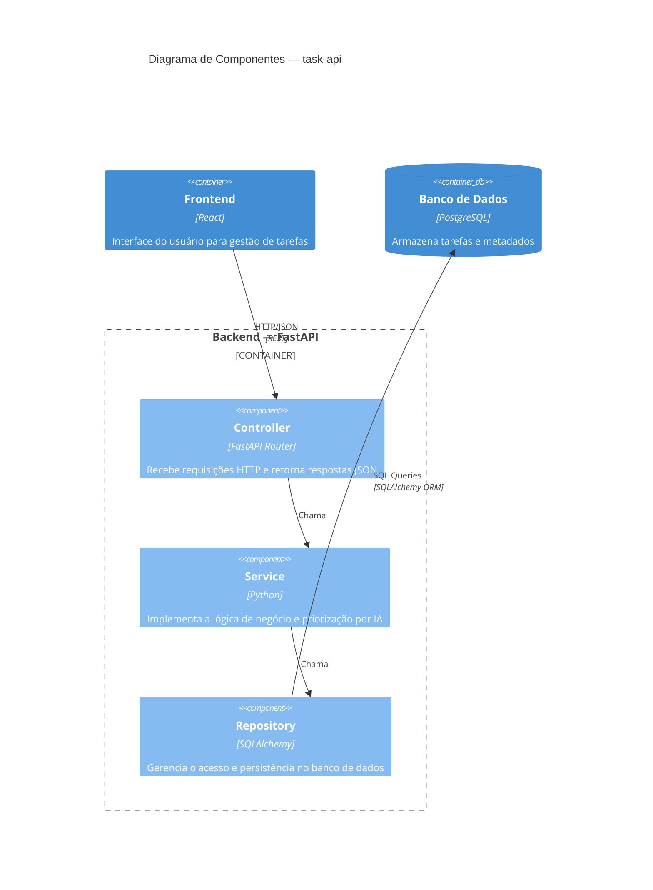

```mermaid
C4Component
    title Diagrama de Componentes — task-api

    Container(frontend, "Frontend", "React", "Interface do usuário para gestão de tarefas")

    Container_Boundary(backend, "Backend — FastAPI") {
        Component(controller, "Controller", "FastAPI Router", "Recebe requisições HTTP e retorna respostas JSON")
        Component(service, "Service", "Python", "Implementa a lógica de negócio e priorização por IA")
        Component(repository, "Repository", "SQLAlchemy", "Gerencia o acesso e persistência no banco de dados")
    }

    ContainerDb(db, "Banco de Dados", "PostgreSQL", "Armazena tarefas e metadados")

    Rel(frontend, controller, "HTTP/JSON", "REST")
    Rel(controller, service, "Chama")
    Rel(service, repository, "Chama")
    Rel(repository, db, "SQL Queries", "SQLAlchemy ORM")
```
